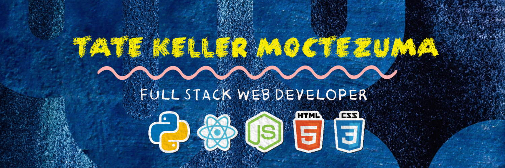

<!--
**tatek1993/tatek1993** is a ✨ _special_ ✨ repository because its `README.md` (this file) appears on your GitHub profile.

Here are some ideas to get you started:

- 🔭 I’m currently working on ...
- 🌱 I’m currently learning ...
- 👯 I’m looking to collaborate on ...
- 🤔 I’m looking for help with ...
- 💬 Ask me about ...
- 📫 How to reach me: ...
- 😄 Pronouns: ...
- ⚡ Fun fact: ...
-->



<p><em>Software Engineer fresh from <a href="https://lambdaschool.com/">Lambda School </a> 
</em></p>


[](https://www.linkedin.com/in/tate-keller-moctezuma/)


##  A little more about me...  

```javascript
const tate = {
    pronouns: "They" | "Them",
    code: {
        'frontend': ['JavaScript', 'ReactJS', 'Redux', 'HTML', 'CSS', 'Boostrap', 'Reactstrap', 'MaterialUI', 'LESS/SASS',],
        'backend': ['Python', 'NodeJS'],
        'database': ['PostgreSQL', 'MySQL', 'SQLite3', 'Postman', 'Knex.JS', 'Express'],
        'devops': ['Docker', 'Netlify', 'GitHub Actions', 'AWS', 'Heroku'],
        'tools': ['GIT', 'npm/yarn', 'GitHub'],
        'misc': ['Firebase', 'TDD', 'SCRUM', 'SOLID', 'GNU/Linux']
    },
    askMeAbout: [],
    architecture: ["Serverless Architecture", "Progressive web applications", "Single page applications"],
    currentProject: "I am developing Extension for NetSuite using SuiteScript2.0",
    funFact: "There are two ways to write error-free programs; only the third one works"
};
```


 <em><b>Want to connect? I'm </b> so if you want to say <b>hi, I'll be happy to meet you more!</b> 😊</em>